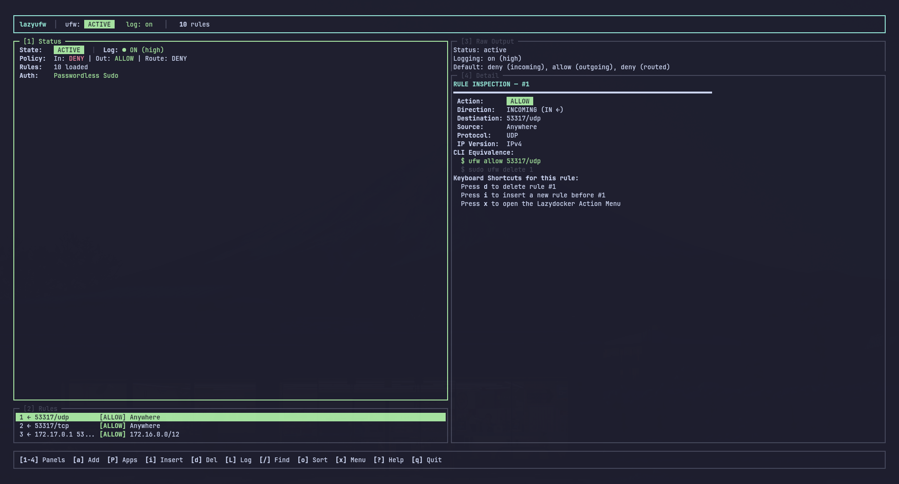
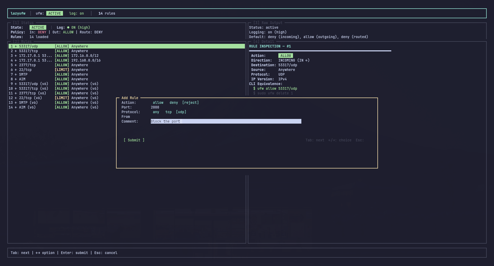
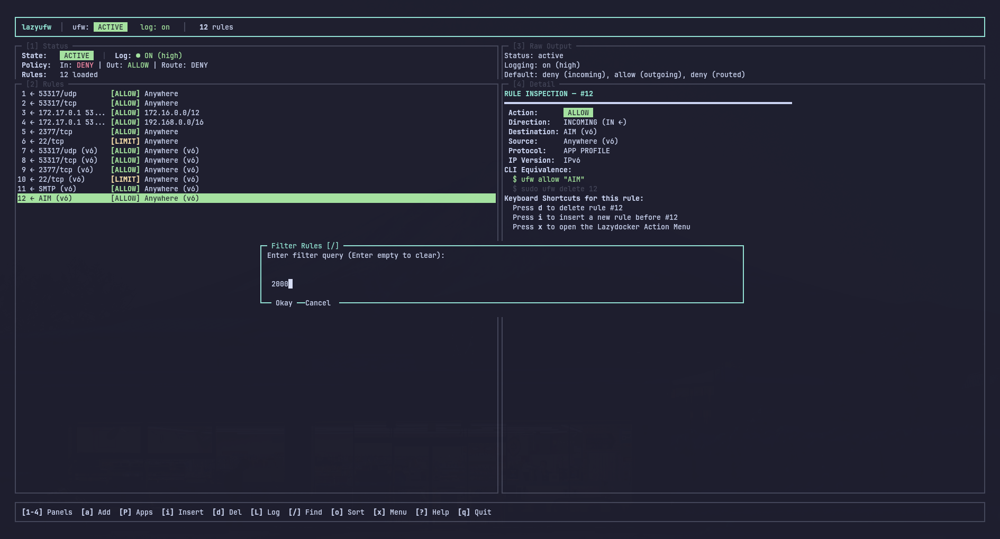
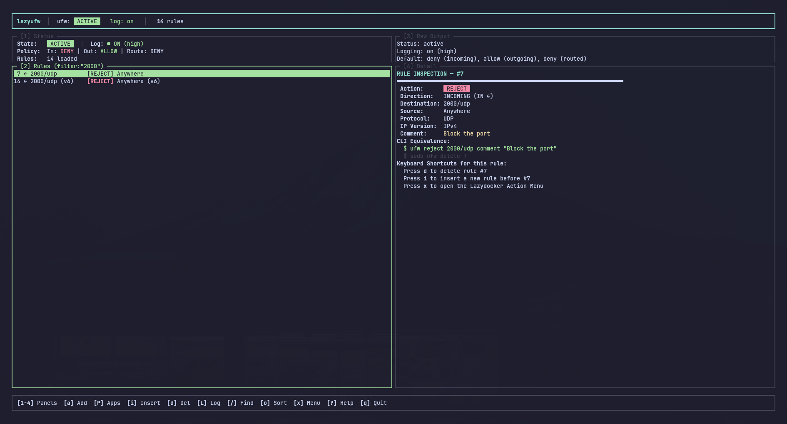
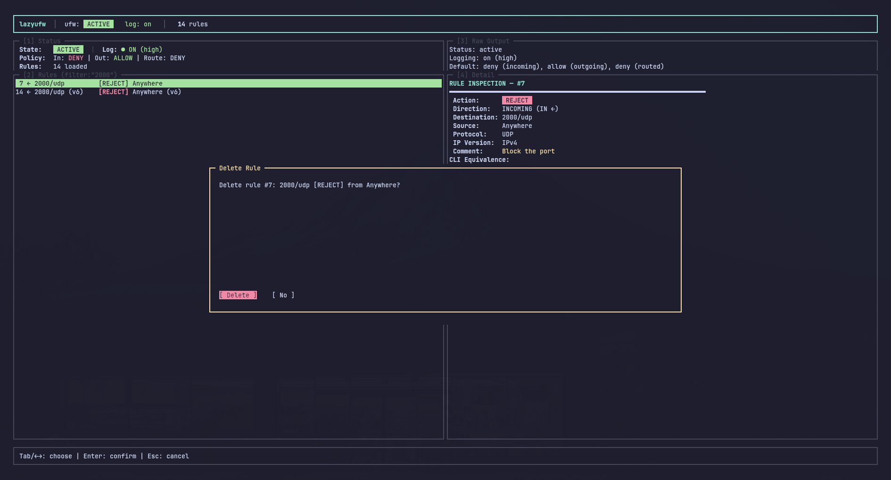
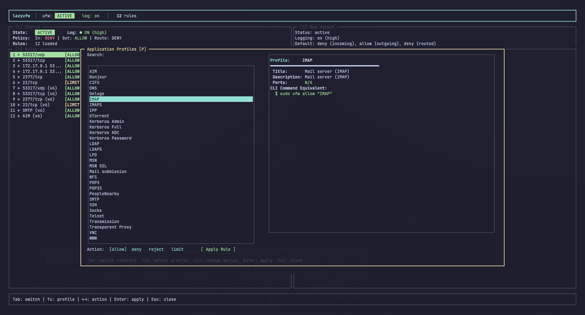
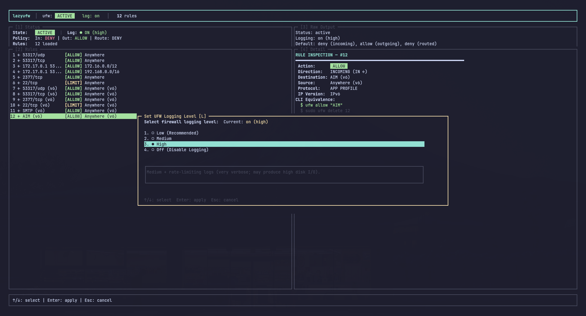
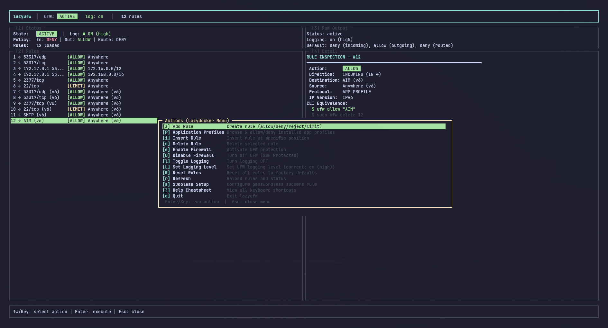
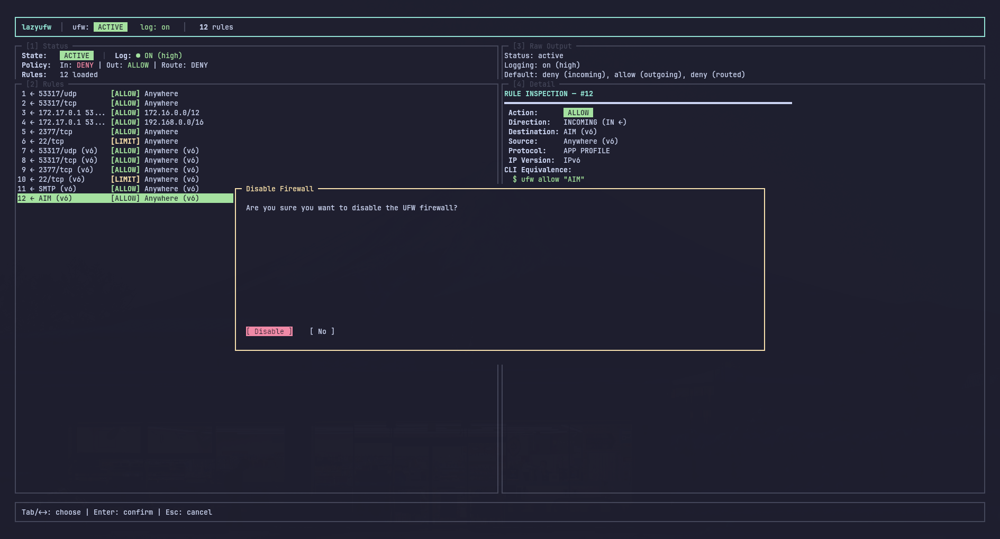

# **lazyufw 🛡️**

> *The lazier way to manage UFW (Uncomplicated Firewall) — Lazydocker-style terminal UI with active SSH lockout protection and sudoless privilege setup.*

[](https://www.npmjs.com/package/lazyufw)

[](LICENSE)

---

## **✨ Features**

* 🖥️ **Lazydocker-Style TUI**: Multi-panel dashboard with dedicated panels for **Status & Policies [**1**]**, **Rules [**2**]**, **Raw Output [**3**]**, and **Rule Inspection & Details [**4**]**.

* 🚀 **Full UFW Feature Coverage**: Full support for `allow`, `deny`, `reject`, `limit`, rule insertion, rule deletion, toggling logging, enabling/disabling firewall, and factory resetting.

* ⚡ **Lazydocker Action Menu**: Press `x` anywhere to open the action menu and run commands instantly.

* 🔒 **SSH Lockout Protection**: Automatically detects active SSH sessions (`SSH_CLIENT`, `SSH_CONNECTION`, `SSH_TTY`) and listening SSH daemons. If a user attempts to disable the firewall, a high-visibility lockout warning modal pops up to prevent accidental disconnection.

* 🔑 **Sudoless Setup**: One-time setup writes a safe, strictly-validated (`visudo -c -f`) drop-in rule in `/etc/sudoers.d/lazyufw-nopasswd` so you never have to type your password for UFW operations.

---

## **📸 Screenshots**

<div align="center">

<table>
<tr>
<td></td>
<td></td>
<td></td>
</tr>
<tr>
<td></td>
<td></td>
<td></td>
</tr>
<tr>
<td></td>
<td></td>
<td></td>
</tr>
</table>

</div>

---

## **📦 Installation**

Install globally via npm:

```bash
npm install -g lazyufw
```

Or run instantly via `npx`:

```bash
npx lazyufw
```

---

## **🔑 One-Time Sudoless Setup**

To run `lazyufw` without being prompted for a `sudo` password on every firewall operation, run:

```bash
sudo lazyufw setup
```

This creates `/etc/sudoers.d/lazyufw-nopasswd` allowing your user to run UFW commands without password prompt.

To revoke permissions later:

```bash
sudo lazyufw teardown
```

---

## **🚀 Usage**

Launch the interactive dashboard:

```bash
lazyufw
```

### **CLI Commands & Flags**

```bash
lazyufw                # Launch the interactive Lazydocker TUI

lazyufw status         # Print verbose firewall status and exit

lazyufw setup          # Configure passwordless sudoers drop-in

lazyufw teardown       # Remove passwordless sudoers drop-in

lazyufw --help         # Show help and keybindings

lazyufw --version      # Show installed version
```

---

## **⌨️ Keybindings**

| Key                   | Description                                                         |
| --------------------- | ------------------------------------------------------------------- |
| `1` / `2` / `3` / `4` | Jump to or toggle maximize on Panel (Status / Rules / Raw / Detail) |
| `Tab` / `Shift+Tab`   | Cycle focus between panels                                          |
| `Esc`                 | Restore default 4-panel split layout                                |
| `x`                   | Open Lazydocker **Action Menu**                                     |
| `a`                   | **Add Rule** (allow, deny, reject, limit by port & protocol)        |
| `i`                   | **Insert Rule** at specific position (e.g. allow from IP)           |
| `d`                   | **Delete** currently selected rule                                  |
| `e`                   | **Enable** UFW firewall                                             |
| `D`                   | **Disable** UFW firewall (*triggers SSH Lockout Protection*)        |
| `l`                   | **Toggle Logging** (on / off)                                       |
| `R`                   | **Reset** firewall (factory wipe custom rules)                      |
| `r`                   | **Refresh** dashboard status & rules                                |
| `s`                   | Setup passwordless sudo helper                                      |
| `?`                   | Show Help cheatsheet                                                |
| `q` / `Ctrl+C`        | Quit                                                                |

---

## **🛡️ SSH Lockout Protection**

Accidentally disabling the firewall on a remote VPS can sever SSH connections or expose the system. `lazyufw` protects remote administrators:

1. When disabling the firewall (hotkey `D` or via Action Menu `x`), `lazyufw` checks whether the current session is connected via SSH or if port 22 is listening.

2. If active SSH is detected, an **SSH Lockout Protection Warning Modal** pops up:

   * Displays client IP, connection port, and TTY.

   * Highlights the risk of lockout in bold red.

   * Defaults focus to `[ Cancel (Keep Safe) ]`.

   * Requires deliberate selection of `[ Force Disable Firewall ]` before any disable command can execute.

---

## **🧪 Development & Testing**

```bash
# Run tests
bun test

# Build release bundle
npm run build
```

---

## **📄 License**

MIT © [Ronak Maheshwari](https://github.com/ronakmaheshwari)